# Updating the Customers Orders Database sample UI to Windows 11

This case study documents the process of updating the user interface (UI) of a UWP app that has evolved over several years to reflect the updated styles of Windows 11.

## Background

This sample is a UWP app that was originally created in 2016 for Windows 10 version 1607 (SDK 14393). It had an adaptive UI to support Windows PCs and Windows Phone. The UI has evolved piece-by-piece over the years as new controls and styles have come along. Here are a few examples:

- ListView was replaced by Telerik RadDataGrid, which was replaced by the Windows Toolkit DataGrid.
- SplitView was replaced by NavigationView.
- A custom expander control was replaced by the Windows Toolkit Expander (which is now replaced by the WinUI Expander).
- WinUI 2 controls and styles were adopted.

The most recent update to the app was to adopt WinUI 2.4, including newer styles with rounded corners on some controls, and migrating some system XAML controls to their WinUI counterparts: NavigationView, ProgressBar, and RadioButtons.

Here's the app UI before any updates for Windows 11.

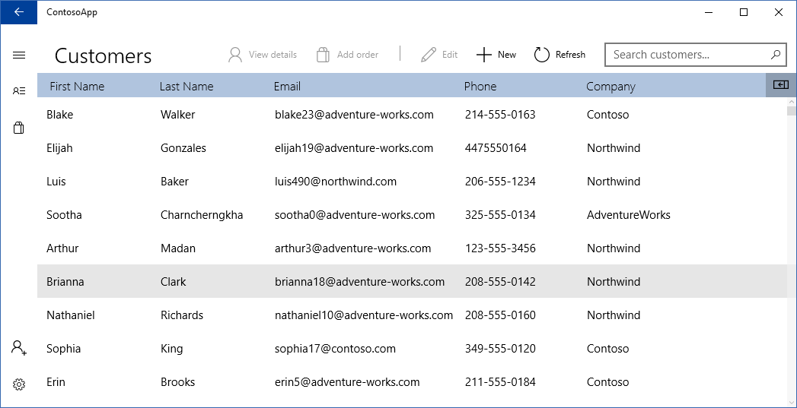

In this case study, we follow the process of updating this UI to adopt the look and feel of Windows 11, and make it feel like it was created for Windows 11 from the beginning.

## WinUI 2.6 and SDK 22000 update

The first step was to update to WinUI 2.6, which has completely new styles designed for Windows 11 (but that fall back gracefully on Windows 10). After being updated to WinUI 2.6, we made sure that any controls that exist in both system XAML and WinUI were updated to use the WinUI version.

Then, the project was re-targeted to SDK 22000 for testing on Windows 11.

After these updates, the UI was reviewed for issues with new styles. The issues listed in the 'Issues found' section were found and resolved.

## Testing

The app was run on Windows 11 to check for issues with the new visual styles.

(It will look different on Windows 10 because many styles will fall back to Windows 10 visuals. But, when you're using WinUI, it will look at home in either context.)

### Tips and tricks

- Ensure that any controls that exist in both system XAML and WinUI are updated to use the WinUI version. See [Controls](https://docs.microsoft.com/en-us/windows/apps/design/controls/) for controls that are in WinUI 2.6.

- It can be difficult to check for the new styles if you don't know what they are supposed to look like. Use the XAML Controls Gallery to see the new controls and compare how they look to your app.
  - [Get the XAML Controls Gallery app (Microsoft Store)](https://www.microsoft.com/store/productId/9MSVH128X2ZT) 
  - [Get the source code (GitHub)](https://github.com/Microsoft/Xaml-Controls-Gallery)
- Search your project for "`TargetType=`" to find all the places where Styles are defined. If the style applies to a system control, make sure the Style definition includes "`BasedOn={StaticResource Default***Style}`", where `***` is replaced by the name of the control.
  (The exception to this is TextBlock, where the Style should be based on `BodyTextBlockStyle`.)

  For more info, see [XAML Styles-Avoid restyling controls](https://docs.microsoft.com/windows/apps/design/style/xaml-styles#avoid-restyling-controls).

- Search your project for "`FontFamily="Segoe MDL2 Assets"`". Replace any instances with `FontFamily="{ThemeResource SymbolThemeFontFamily}"`

- If you have any controls that are derived from a system or WinUI control (like ContentDialog), ensure that they apply the WinUI control style. For more info, see [XAML Styles-Derived controls](https://docs.microsoft.com/windows/apps/design/style/xaml-styles#derived-controls).  

## Issues found

### Page Background

The root Grid of each page had a background that conflicted with the new style of the NavigationView.

| Before | After |
| ------ | ----- |
| 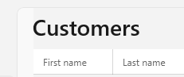 | 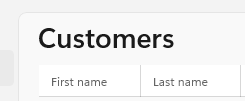 |

The difference is hard to see on some screens, so here's the image with the color adjusted to highlight the issue.

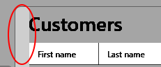

By default, the Visual Studio XAML Page template sets the background of the Page's root grid. With the new styles, pages in a NavigationView should have a transparent (unset) background; the NavigationView content area provides the background instead. This follows the [Windows 11 layering](https://docs.microsoft.com/windows/apps/design/signature-experiences/layering) principle and let's the [Mica material](https://docs.microsoft.com/windows/apps/design/style/mica#dos-and-donts) show through (when it's used).

**Fix:** Make the root element of the NavigationView content transparent.

- [commit bb88680](https://github.com/microsoft/Windows-appsample-customers-orders-database/commit/bb88680ab597172bbe2054fa0610b1caef9d22c7#diff-800048dd63e9e20e99a7341287221cdff3192bfe282b4351ee2e7bb2470da64a) Remove page background that conflicts with new styles

### Order list page preview pane

The order list page shows a preview pane when an item is selected in the list.

| Before | After |
| ------ | ----- |
| 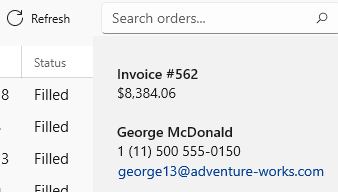 | 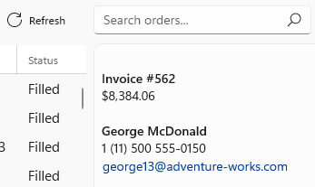 |

- Before the page background was removed (see previous issue), the preview pane used the same background color as the page. This didn't follow the Windows 11 layering principle.
- After the page background was removed, the color, spacing, and square corners of the preview pane did not match the updated styles.

**Fix:** Update the margins, padding, and corner radius of the preview pane's root StackPanel. Use built-in theme resources to get the recommended system colors for Windows 11 layering. For more info, see [App layering with Mica](https://docs.microsoft.com/en-us/windows/apps/design/style/mica#app-layering-with-mica).

- [commit eceb6b3](https://github.com/microsoft/Windows-appsample-customers-orders-database/commit/eceb6b307ab3fa76da048d2e211b10d2c7212d7a#diff-800048dd63e9e20e99a7341287221cdff3192bfe282b4351ee2e7bb2470da64a) update order preview pane to match new styles

### ComboBox controls not rounded

ComboBoxes on the order detail page didn't get the new styles with rounded corners.

| Before | After |
| ------ | ----- |
| 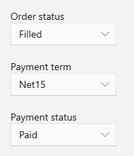 | 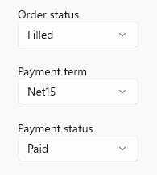 |

These combo boxes used an implicit Style to set the MinWidth property. For system controls that use WinUI styles, styles must be updated to be based on the WinUI default style in order to pick up the new look. Otherwise, they pick up the older system style. For more info, see [Avoid restyling controls](https://docs.microsoft.com/windows/apps/design/style/xaml-styles#avoid-restyling-controls).

**Fix:** Base the custom style on DefaultComboBoxStyle.

- [commit 388c611](https://github.com/microsoft/Windows-appsample-customers-orders-database/commit/388c611e1a17863e2cdad18809c0590b578c0b08#diff-800048dd63e9e20e99a7341287221cdff3192bfe282b4351ee2e7bb2470da64a) Base ComboBox style on default to get new styles

### ListView not styled correctly

The list of items in the order detail screen was not using the updated styles, which is most easily seen by the presence of the Reveal highlight.

This also happened in the list of search result suggestions in the product search AutoSuggestBox.

| Before | After |
| ------ | ----- |
| 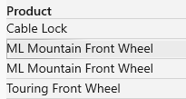 | 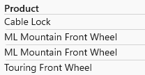 |

This was another case of properties being set in an implicit Style, which caused the list view items to inherit the system style instead of the updated WinUI style.

**Fix:** Base the custom style on DefaultListViewItemStyle.

- [commit c97be5a](https://github.com/microsoft/Windows-appsample-customers-orders-database/commit/c97be5a15049ccaefbf189603e07c22dfef9e906#diff-800048dd63e9e20e99a7341287221cdff3192bfe282b4351ee2e7bb2470da64a) Base custom styles on WinUI styles

### Menu flyout items not styled correctly

MenuFlyoutItems in the context menus of the DataGrid controls had rounded corners, but had incorrect styling on pointer over (inner highlight was not rounded).

| Before | After |
| ------ | ----- |
| 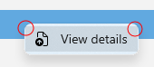 | 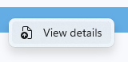 |

The menu flyout items were using a custom template to include an icon because the Icon property was not added until version 1703 (SDK 15063). The custom template was based on old styles.

**Fix:** Remove the custom template and add the Icon using the Icon property.

- [commit 6c13217](https://github.com/microsoft/Windows-appsample-customers-orders-database/commit/6c13217251b656afac444cfb1a98247077b4f7c4#diff-800048dd63e9e20e99a7341287221cdff3192bfe282b4351ee2e7bb2470da64a) Remove custom template for MenuFlyoutItem

### Dialog not styled correctly

The unsaved changes dialog (that appears when navigating away from a page with edits) did not have updated styles.

| Before |
| ------ |
| 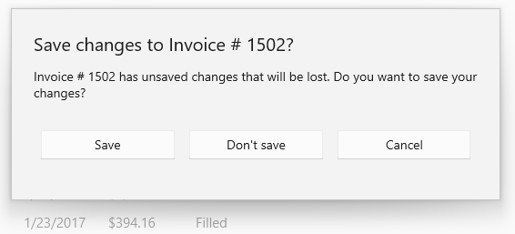 |

| After |
| ------ |
| 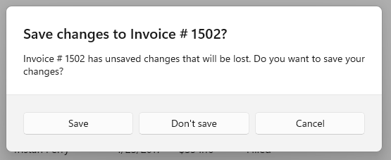 |

There were several things happening here.

- When you derive a custom dialog from a ContentDialog, it does not get the WinUI 2 styles by default. You have to apply a style that's based on the default WinUI style by following the steps described in [Derived controls with WinUI styles](https://docs.microsoft.com/uwp/api/windows.ui.xaml.controls.contentdialog?view=winrt-20348#derived-controls-with-winui-styles) on the ContentDialog class page. This will give the dialog rounded corners, but will not resolve the issues in the following bullets.

- The dialog was written with buttons in the body of the dialog content, rather than using the built-in button properties (presumably because the close button was not added until version 1703). Because the the buttons and text were all in the Content of the dialog, the dialog didn't show the new dialog style where the buttons and content are visually separated.

- The buttons in the body of the dialog used a custom implicit style that was not based on the WinUI style, so they didn't get the new style. Updating the implicit button style to be based on the default WinUI style would give the buttons rounded corners and other new styling, but would not fix issue in the previous bullet.

**Fix:** Re-write the dialog to use the built-in properties, and also to use a style based on the WinUI default content dialog style.

- [commit e58a1ce](https://github.com/microsoft/Windows-appsample-customers-orders-database/commit/e58a1ce6744e7b659bf0569e09e666e6df5c8d24#diff-800048dd63e9e20e99a7341287221cdff3192bfe282b4351ee2e7bb2470da64a)  Update dialog to use built in styles, content, and buttons
- [commit 35422d0](https://github.com/microsoft/Windows-appsample-customers-orders-database/commit/35422d0c1c19157925fb8eee2ddf8a0e7f961d00#diff-800048dd63e9e20e99a7341287221cdff3192bfe282b4351ee2e7bb2470da64a) Remove obsolete styles and XAML

### Sign-in control style not updated

The style of the custom login control did not match the updated NavigationViewItem styles.

| Before | After |
| ------ | ----- |
| 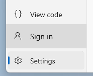 | 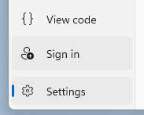 |

The custom sign-in control used Buttons and Grids that were styled to look like the old navigation menu items style (due to originally being used in a SplitView, before there was a NavigationView control).

**Fix:** Update the sign-in control to use NavigationViewItem elements, so it gets the new styles by default.

- [commit e8533d5](https://github.com/microsoft/Windows-appsample-customers-orders-database/commit/a8533d51642908fdc1d118d2378e83eea4e39cfa#diff-800048dd63e9e20e99a7341287221cdff3192bfe282b4351ee2e7bb2470da64a) Update to use NavigationViewItems and updated styles

### Wrong font used for icons

There were a few places were the Segoe MDL Assets font was hard-coded.

| Before | After |
| ------ | ----- |
| 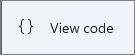 | 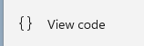 |

Windows 11 introduces a new system icon font, Segoe Fluent Icons. This new font compliments Windows 11's geometry.

**Fix:** To let the system choose the correct font family depending on where the app is run, set the FontFamily property to `{ThemeResource SymbolThemeFontFamily}`. In a FontIcon (or FontIconSource), this is the default, so you don't need to set the FontFamily property.

- [commit fc7c0ea](https://github.com/microsoft/Windows-appsample-customers-orders-database/commit/fc7c0ea8ecf3c5732a6fbeec5ab1334f59307f24#diff-800048dd63e9e20e99a7341287221cdff3192bfe282b4351ee2e7bb2470da64a) replace hardcoded font with theme resource

### Icon is cut off in button

The icon for the custom expandable search box was cut off.

| Before | After |
| ------ | ----- |
| 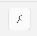 |  |

With the new styles, the ToggleButton Padding needs to be set to 0 at this size so the icon has enough space.

**Fix:** Update the padding on the toggle button.

- [commit 9826189](https://github.com/microsoft/Windows-appsample-customers-orders-database/commit/9826189d5affaa281bd9c4ed9521165cf11c7b2e#diff-800048dd63e9e20e99a7341287221cdff3192bfe282b4351ee2e7bb2470da64a) Update padding on ToggleButton to work with new styles

**Alternate Fix:** Change to use AnimatedIcon. (See #2 in next section.)

## New WinUI 2.6 additions

After fixing the style issues found, these updates were made to take advantage of new features in WinUI 2.6.

1. Replace TextBox with NumberBox on order detail page. [commit 0f96472](https://github.com/microsoft/Windows-appsample-customers-orders-database/commit/0f964724a99604aa1f97485cdaf73600f8d80011#diff-800048dd63e9e20e99a7341287221cdff3192bfe282b4351ee2e7bb2470da64a)
1. Add an AnimatedIcon to the search box. [commit c725a3b](https://github.com/microsoft/Windows-appsample-customers-orders-database/commit/c725a3b3d46fd3ec6cd43b5d4cf95ad320dc73f3#diff-800048dd63e9e20e99a7341287221cdff3192bfe282b4351ee2e7bb2470da64a)
1. Use Mica material. [commit b3d02fc](https://github.com/microsoft/Windows-appsample-customers-orders-database/commit/b3d02fc4efbe9a54958cab5f6d86b319a5bc4a9f#diff-800048dd63e9e20e99a7341287221cdff3192bfe282b4351ee2e7bb2470da64a)

    This screenshot shows Mica applied to the app, but not extended into the title bar.

    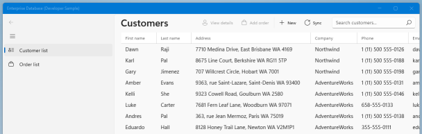

1. Use Mica with background extended into title bar. [commit 45e5506](https://github.com/microsoft/Windows-appsample-customers-orders-database/commit/45e55065747c75204026de25f95cecf09e6ff6ea#diff-800048dd63e9e20e99a7341287221cdff3192bfe282b4351ee2e7bb2470da64a)

## Updated UI

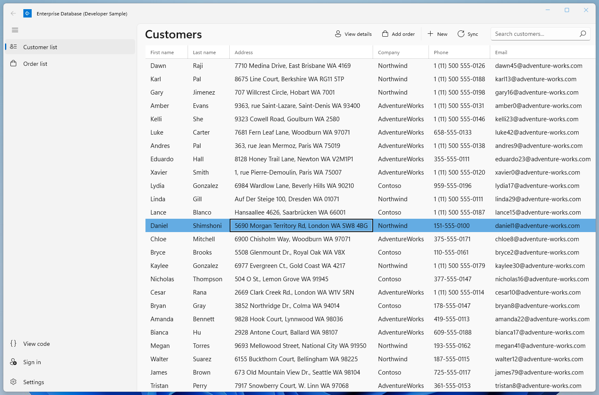

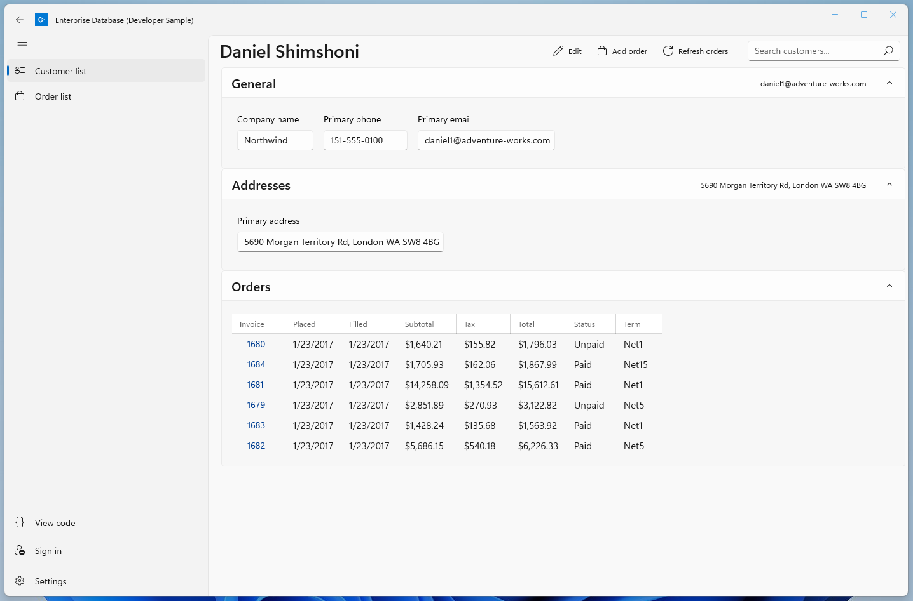

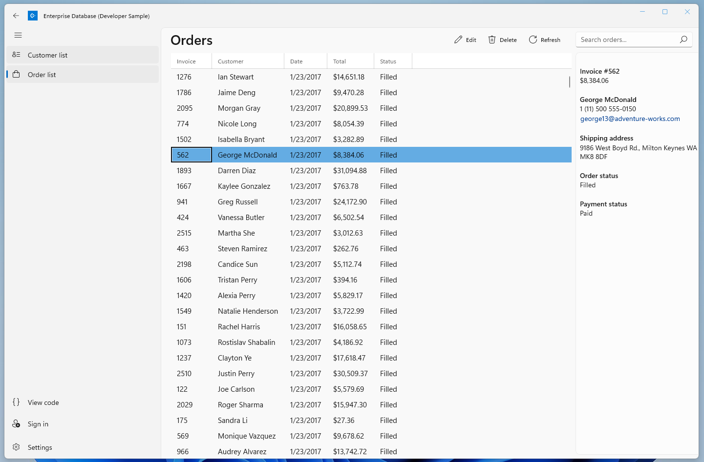

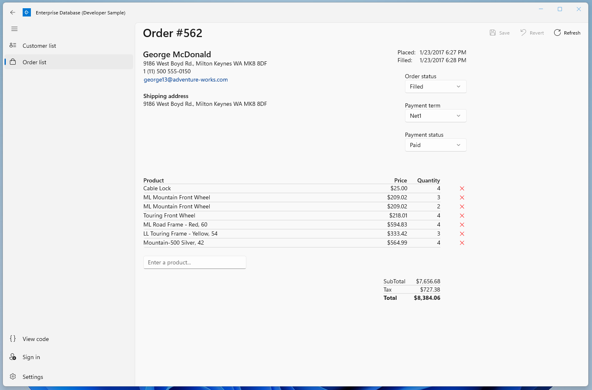